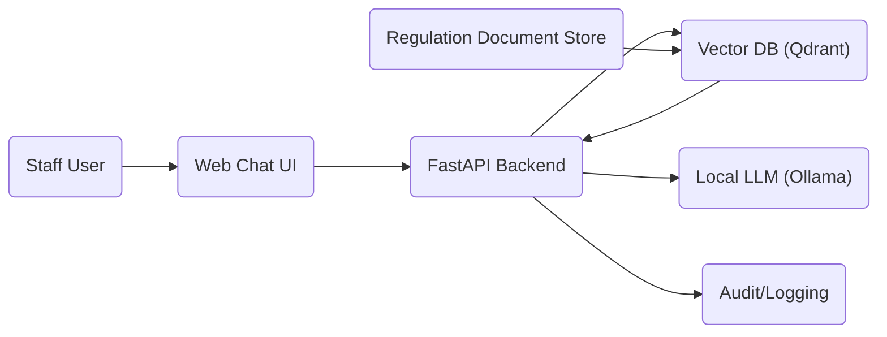
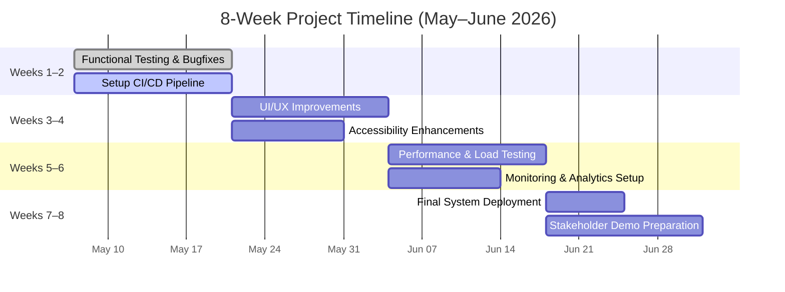

# Executive Summary  

> **Historical planning analysis only.** This document is not current readiness evidence. Its official-source, testing, metric, logging, security, deployment, and board-readiness statements are recommendations or historical assumptions, not verified current capabilities. See `docs/PROJECT_STATE.md`; presentation remains blocked.

The EMU Regulation Assistant is a demo RAG (Retrieval-Augmented Generation) system answering staff questions about Eastern Mediterranean University rules using indexed official sources.  It currently provides cited answers in English and Turkish via a web chat UI.  We recommend comprehensive end-to-end verification (functional, security, performance, UX, etc.) and prioritizing fixes and enhancements to make the demo board-ready.  Key actions include building test suites (functional and load), tightening security (input validation, encryption, access control), hardening deployment (CI/CD, monitoring), and polishing the UI/UX (visual design, onboarding, responsiveness).  This report lists specific test items and tasks, assesses risks, defines success criteria, and outlines a demo storyboard and roadmap.  

**Key recommendations:** Automate and run extensive QA tests (including cross-browser and accessibility checks【15†L33-L42】【18†L255-L263】); fix high-impact bugs first (e.g. retrieval accuracy, citation formatting); enhance backend robustness (CI/CD, monitoring, security hardening) before the demo; and apply UI/UX improvements (branding, hierarchy, contextual help【22†L132-L140】).  Define and track metrics like answer accuracy and latency【13†L209-L217】【13†L246-L254】.  Prepare clear demo slides (problem statement, live Q&A example, metrics, roadmap).  The following sections detail prioritized tasks, test plans, risk mitigations, and recommended metrics for stakeholders.

## Testing & Verification Checklist  
We must verify every functional and non-functional aspect of the demo. Key test categories include: 

- **Functional testing:**  Verify core QA flows.  Test example regulation questions in both English and Turkish.  Ensure answers cite the correct source text.  Test ambiguous queries to confirm the system asks clarifying questions or flags uncertainty.  Test out-of-scope queries (e.g. student information or unrelated topics) to ensure polite refusal.  Verify multi-turn flow if applicable (session continuity).  *Acceptance:* Answers must correctly quote regulation excerpts with citations (per spec requirements), or appropriately refuse with an explanation.  
- **Edge cases:**  Input format: empty queries, overly long queries, special characters (e.g. SQL syntax, script tags).  Queries in the “wrong” language (e.g. Turkish question when English corpus only).  Numeric or date-based queries.  *Acceptance:* System should gracefully handle invalid input (e.g. ignore or warn on blank query; sanitize/neutralize injection attempts).  Ambiguous or multiple-intent queries should trigger a clarification prompt rather than a wrong answer.  
- **Cross-browser/platform:**  Test on major browsers (Chrome, Firefox, Safari, Edge) and platforms (Windows, macOS, Android, iOS).  Ensure the chat interface renders and functions correctly (buttons clickable, text input works) on desktop and mobile viewport sizes.  *Acceptance:* The UI layout and controls should display properly in each browser.  Functional elements (form submit, checkboxes) must work consistently.  (Cross-browser testing ensures consistent behavior across rendering engines【15†L33-L42】.)  
- **Data integrity and correctness:**  Verify that the knowledge corpus is correctly ingested and indexed.  For known queries, check that the correct document chunks are retrieved.  Test adding/removing documents to ensure the index updates as expected.  Validate any structured data (e.g. tables, salary facts) used for answers.  *Acceptance:* Retrieved document chunks match known sources; no content is lost or scrambled.  Data artifacts (JSONL, logs) should remain well-formed (use schema validation).  
- **Security and compliance:**  **Input validation:** Attempt malicious queries (e.g. script injections, SQL commands) to confirm the system sanitizes or rejects them.  **Authentication/Access:** If an admin console or private endpoints exist, verify they require proper credentials.  **Transport security:** Ensure HTTPS is enforced (self-signed or valid cert) and security headers (e.g. CSP, HSTS) are set.  **Data security:** Confirm that sensitive configuration (API keys, database credentials) are not exposed.  *Acceptance:* No XSS or injection vulnerabilities; all external calls and data stores are protected by encryption and auth.  (Implement RAG best practices: input sanitization, encryption of data at rest/in transit, and strict access control【25†L76-L84】【25†L85-L92】.)  
- **Performance/load:**  Simulate concurrent users using load tools or `load_test.py`.  Measure query latency and throughput under stress (e.g. 50+ concurrent sessions).  Profile CPU, memory usage of the server/LLM under load.  *Acceptance:* The system should handle expected load (e.g. N users) with latency under a target threshold (aim for ~1–2s per query【13†L246-L254】).  Identify bottlenecks (API vs model vs DB). (Performance tests should include both API-level and real-browser flows【27†L141-L150】.)  
- **Accessibility:**  Check basic WCAG compliance: ensure all UI controls have labels/ARIA attributes, sufficient color contrast, and keyboard navigability.  Use a screen reader or a tool to test reading the interface.  *Acceptance:* All interactive elements are reachable via keyboard and properly labeled; color contrast meets standards.  (Accessibility testing ensures usability for users with disabilities【18†L255-L263】.)  
- **Localization:**  Verify that language detection/routing works: English queries search the English corpus, and Turkish queries search the Turkish corpus.  No EN/TR corpus-comparison selector should be exposed in V1.  Check that text snippets remain untranslated and unmixed.  *Acceptance:* Answers should cite in the detected query language.  The UI indicates source language.  (The system spec forbids mixing languages.)  
- **Analytics & logging:**  Confirm that all queries and responses are logged (AuditLogger).  Check that usage analytics (query count, error rates) are collected.  *Acceptance:* Logs must record timestamps, user session ID, questions, actions.  Sample queries should appear in analytics dashboards or logs.  
- **CI/CD & deployment:**  Ensure there is an automated build/test pipeline.  Test deploying the app (e.g. via Docker or VM).  Simulate rollback or upgrades.  *Acceptance:* On each commit, automated tests run and either succeed or flag failures.  Deployment scripts should reliably launch the server and UI.  (CI/CD best practices: automated testing/deployment and versioned pipeline configs【20†L165-L173】【20†L177-L185】.)  

## Implementation Tasks (Prioritized)  
Based on impact and dependencies, tasks are prioritized as follows. Estimated effort is relative (H=High, M=Medium, L=Low); impact is on demo-readiness (H=high, M=medium, L=low).

| Task / Feature                                   | Effort | Impact |
|--------------------------------------------------|:------:|:------:|
| **Critical bug fixes:** Ensure core Q&A works reliably (fix any retrieval errors or citation bugs) | H | H |
| **Functional test suite:** Develop automated tests covering QA flows, edge cases, cross-browser (including Selenium/Playwright scripts)【18†L337-L344】 | M | H |
| **Performance testing & tuning:** Run load tests; optimize slow queries or model calls | M | H |
| **Security hardening:** Implement input sanitization, enforce HTTPS/CSP, add auth for admin; scan for vulnerabilities | M | H |
| **CI/CD pipeline:** Set up automated builds, tests, and deployment (e.g. GitHub Actions or Jenkins)【20†L165-L173】 | M | H |
| **Analytics integration:** Install tracking (e.g. Google Analytics or open-source) to report usage metrics | L | M |
| **Corpus expansion:** Ingest any missing regulations or updates into knowledge base; create ingestion scripts for future docs | M | M |
| **Evaluation dataset:** Finalize human-reviewed test set; compute metrics (F1, accuracy) against it | M | M |
| **Answer quality evaluation:** Tune retriever/LLM (increase top_k, prompt improvements) to improve answer correctness | H | M |
| **Monitoring/Alerts:** Deploy observability (e.g. Prometheus metrics, alert on errors/latency spikes) | M | M |
| **UI/UX redesign:** Improve styling (fonts, spacing, branding colors), reorganize layout for clarity | M | H |
| **Onboarding flow:** Add a concise welcome message or tooltip explaining how to ask questions; implement contextual help instead of pop-up tutorial【22†L132-L140】 | L | M |
| **Accessibility fixes:** Ensure ARIA attributes, alt text on images, high contrast mode | L | M |
| **Responsive layout:** Adjust CSS to support mobile devices, test on phone/tablet sizes | L | M |
| **Branding and graphics:** Add EMU logo, consistent color scheme (use official palette) | L | L |
| **Demo script preparation:** Draft example scenarios and talking points; prepare visuals for demo slides | L | H |
| **KPI dashboard:** Create a simple dashboard (e.g. in admin UI) to display metrics (accuracy, queries per day) to stakeholders | M | M |
| **Documentation:** Update README/sprint plan with installation steps, usage guide | L | L |

_Note:_ Assumptions include use of Python/FastAPI with a Qdrant vector store and local LLM (Ollama). Users are EMU staff (academics, admin) who speak English or Turkish. No sensitive student data is used. Compliance requires clear disclaimers that answers are informational.  

## UI/UX & Design Improvements  
To impress stakeholders, the demo UI must be polished and intuitive:  

- **Visual polish & branding:** Use the university’s color palette (navy, gold) and logo prominently【15†L132-L139】. Refine typography and spacing for a clean look. Apply consistent styling (buttons, headers). Ensure information hierarchy: clearly label the chat area, input box, and citation list.  
- **Layout & hierarchy:** Structure the page so that the Q&A and citations are easy to scan. Consider highlighting answer text with color blocks. Use sections or cards for each message. Emphasize cited references at the bottom (smaller font or footnote style). The admin panel (if shown) should have a clear layout for modes and metrics.  
- **Onboarding & context help:** Rather than an intrusive tutorial, provide contextual hints. For example, a brief placeholder text in the input (“Ask about EMU rules…”). Offer an “info” icon or tooltip next to the input explaining the system’s purpose. If clarifications are needed, guide the user with example prompts. Good UX research shows that pushy tutorials hurt performance; instead, deliver help just-in-time【22†L132-L140】.  
- **Demo script & storytelling:** Prepare a scenario of how an EMU staffer uses the system: e.g. “The user wants to know about leave policies. They ask a clear question and receive a cited answer. Then they ask a follow-up. Next, show an ambiguous query and the system asking for clarification.” The slides should narrate this flow with screenshots or animations. Include a slide summarizing key performance metrics and future roadmap.  
- **KPI dashboards:** Add a visual dashboard (chart/graphs) showing metrics like answer accuracy (via evaluation set) and usage stats. Use simple charts (bar or line graphs) for queries/day or latency distributions. This helps convey success quantitatively. See metrics section below.  
- **Responsive design:** Ensure the UI adapts to smaller screens. For example, stack elements vertically on mobile, enlarge touch targets. Test with browser dev tools and on actual devices. It’s crucial for accessibility and broad reach【18†L307-L315】.  
- **Accessibility enhancements:** Verify that color contrast meets WCAG 2.1 standards and all controls have proper labels (ARIA). For example, the “Ask” button and checkboxes should have descriptive labels. Incorporate hidden screen-reader text for any non-text elements. The example admin HTML already uses `aria-label` (good practice). Follow WCAG guidelines to make the app usable for all users【18†L255-L263】.  

## Assumptions  
- **Tech stack:** Python 3.x, FastAPI backend, Qdrant or similar vector DB for embeddings, Ollama/local LLM for generation, a JS frontend. Deployed on a server with GPU for LLM or inference engine.  
- **Users:** EMU academic and admin staff (primary), bilingual (English/Turkish). Interface text is English, queries can be in either language.  
- **Data:** Uses only public EMU regulations. No private data, so privacy rules (e.g. FERPA) are not directly involved, but standard security is required. Assume university policy requires disclaimers on informational bots.  
- **Compliance:** Adhere to accessibility laws (WCAG) and university branding guidelines. Emphasize that this is a demo (not legal advice).  

## Risk Assessment & Mitigation  

| Risk                               | Likelihood | Impact | Mitigation / Controls                                |
|------------------------------------|:----------:|:------:|------------------------------------------------------|
| **Inaccurate/hallucinated answers:** RAG models may produce wrong answers or paraphrase incorrectly. | M | H | Establish rigorous evaluation (F1/accuracy on gold set); require citations for every claim. Add disclaimers (“informational only”) and instruct model to refuse if uncertain. A human review or dual-check (retriever+LLM) can catch errors. |
| **Outdated or missing corpus:** If regulations change, answers will be wrong. | H | M | Institute a regular update pipeline: schedule periodic re-crawls of mevzuat.emu.edu.tr. Version the corpus and log update dates. Mark any outdated info clearly. |
| **Security breaches (data leaks, injection):** Malicious inputs or vulnerabilities in RAG pipeline. | M | H | Follow RAG security best practices: sanitize all inputs to prevent injection【25†L85-L92】. Encrypt data stores and use HTTPS. Require strong auth (MFA, RBAC) for admin functions【25†L92-L96】. Regularly audit code and dependencies. |
| **System downtime/performance failures:** Under heavy load or crashes, service unavailability. | M | H | Perform load testing and capacity planning. Monitor key metrics (CPU, memory, latency) and set alerts. Use auto-restart or container orchestration for resilience. Keep performance headroom. |
| **Low user adoption/UX confusion:** If UI is not intuitive, stakeholders may not see value. | M | M | Conduct a quick usability review. Use contextual help and clear messaging【22†L132-L140】. Iterate on design based on feedback. Provide a concise demo script to guide first-time users.  |
| **Compliance/legal risk:** Misrepresentation of advice as official. | L | H | Ensure every answer includes source citations and a standard disclaimer (“official references only; verify with EMU”) per the spec. Disable any personal data queries (explicitly forbidden). |
| **Scope creep/delays:** Adding features beyond demo scope (e.g. student advising) could derail timeline. | M | M | Strictly adhere to the V1 scope (regulations only). Keep new features in backlog, not in demo. Maintain the product spec as source of truth. |

By addressing these risks with the above controls (e.g. input validation, update processes, monitoring), we minimize failure modes. For example, input sanitization and access controls follow RAG security guidelines【25†L85-L92】【25†L92-L96】. Automated testing and CI/CD with alerts help catch regressions early【20†L165-L173】【20†L177-L185】.

## Test Cases & Acceptance Criteria  

| Test Case / Scenario                             | Acceptance Criteria                                                 |
|--------------------------------------------------|----------------------------------------------------------------------|
| **Valid query (English)** – e.g. “What is the attendance requirement?” | System returns a clear answer in English with exact regulation text quoted, and one or more citations to EMU sources. Answer is grammatically correct and displayed quickly (e.g. <2s). User can scroll to view citations. |
| **Valid query (Turkish)** – similar question in Turkish. | Returns answer in Turkish with quoted Turkish regulation and citations. (Language-based routing is correct.) |
| **Ambiguous query** – question with multiple possible meanings (e.g. “What about graduation?”). | System asks a clarifying question rather than guessing. (E.g. “Which program or context do you mean?”) The user flow is clear and no wrong answer is given. |
| **Out-of-scope query** – unrelated or forbidden content (“How to hack SIS?”). | System politely refuses or redirects to human/admin (“Sorry, I cannot answer that. Please consult EMU staff.”). No attempt to answer unrelated content. |
| **Empty input** – user submits blank or whitespace. | UI ignores or prompts the user to enter a question. No crash or server error. |
| **Stress test (load)** – simulate N concurrent users (e.g. 50). | 95% of responses complete within the latency target (e.g. <2s). No server crashes or queue overflows. Error rate (500/503) stays near 0%. |
| **Security test (injection)** – input a query with special chars or scripts (`<script>alert(1)`). | The system either sanitizes the input or rejects it, logging the attempt. The alert/script does not execute. No sensitive data is revealed. |
| **Cross-browser UI** – open the site in Chrome, Firefox, Safari, Edge. | All UI elements (input box, buttons, results) appear correctly. Chat messages format consistently. No missing elements. Keyboard tab order is logical. |
| **Responsive UI (mobile)** – view on narrow screen (phone size). | Layout adapts (e.g. chat bubbles stack). Text remains readable without overflow. “Ask” button and checkboxes are accessible on touch. |
| **Accessibility** – use keyboard-only navigation and a screen reader. | All interactive elements (question input, checkboxes, Ask button) are focusable and labeled. Screen reader announces question field and results correctly. Contrast ratios meet standards. |

Each test must be repeatable. For example, the “Valid query” test would be run against a known question-answer pair in the gold evaluation set; acceptance means the exact expected quote appears in the answer (thus verifying retrieval accuracy). The “Stress test” can be automated with tools like Locust or the provided `load_test.py` to validate performance criteria【27†L141-L150】【13†L246-L254】. 

## Recommended Metrics  

To demonstrate value to stakeholders, track both technical and user-oriented metrics. Key metrics include:

| Metric                   | What it Measures                                | Example Target or Use                              |
|--------------------------|-------------------------------------------------|----------------------------------------------------|
| **Answer Accuracy (F1 / Exact Match)** | How often the assistant’s answers match ground truth (from a labeled dataset). High score means correct answers. | Use the curated evaluation set; aim F1 > 80%. (See QA metrics guidelines【4†L115-L124】.) |
| **Retriever Recall@K**   | Fraction of queries where the correct document was among the top-K retrieved. Indicates coverage of relevant sources. | Aim > 90% for top-5 retrieval on test set. Helps diagnose retrieval misses. |
| **Response Time (Latency)** | Time from user submitting a query to answer display. Faster is better. | Target <1s for backend; show 90th percentile on dashboard. (Low latency ~0.1–1s【13†L246-L254】.) |
| **Queries per Minute (Throughput)** | How many questions the system handles per minute at normal load. | Ensure it meets expected usage (e.g. 100 QPM). Track to plan scaling. |
| **System Uptime / Error Rate** | Percentage of time the service is available without errors. | Aim > 99% uptime. Monitor 5xx errors; alert on spikes. |
| **User Engagement (e.g. Sessions / Day)** | Number of distinct users or sessions interacting. | Indicative of adoption. No prior baseline for a demo, but growth over time is good. |
| **User Satisfaction (Qualitative)** | Survey or feedback rating from staff (e.g. ease of use). | Not measurable automatically, but gather at demo. Look for “resolved my question” vs “unsure”. |
| **Compliance Checks** | (Derived) Count of queries refused vs answered. | E.g. % of queries correctly refused as out-of-scope. Should be high for non-reg queries, showing correctness. |

Reporting these metrics (with visuals like graphs or gauges) will make the demo convincing. As one expert notes, “subjective impressions are not enough” – use quantifiable metrics to prove system quality【4†L115-L124】. In particular, tracking accuracy and latency demonstrates both correctness and performance. For stakeholders, showing that e.g. 85% of questions are answered correctly with citations and average response <1s will build confidence.  

## Storyboard: Stakeholder Demo Slides  

- **Slide 1 – Introduction & Vision:** Title (“EMU Regulation Assistant”) and brief goal: “Answer staff questions about EMU regulations with cited sources.” Include EMU logos/branding. Summarize scope (staff queries only).  
- **Slide 2 – Architecture:** Show a simplified system diagram (e.g. a flowchart or the Mermaid diagram below) and describe components: web UI, backend retrieval, LLM, document store. Emphasize local-only data and transparency (each answer cites sources).  
- **Slide 3 – Example Use Case:** Walk through a live demo scenario: the user asks, “How many days of medical leave can I take?” The system retrieves relevant regulations, displays a summarized answer, and quotes the exact law with citations. Show screenshots of the query and answer. Highlight the question, answer snippet, and citation footnotes.  
- **Slide 4 – Handling Edge Cases:** Show how the assistant deals with tricky inputs: e.g. ambiguous or out-of-scope query. For instance, ask a vague question or a forbidden one and demonstrate the assistant asking for clarification or refusing politely. This slide demonstrates robustness (per design spec).  
- **Slide 5 – Performance & Metrics:** Present key metrics (from the table above). Include charts or gauges: e.g. accuracy on test set, average latency, uptime, query volume. This quantifies success (using metrics like those recommended by deepset and AI best practices【4†L115-L124】【13†L246-L254】).  
- **Slide 6 – Roadmap & Next Steps:** Outline the 8-week plan (see Gantt below). List major upcoming milestones (e.g. finalize UI improvements, complete evaluation, roll out to pilot users). Emphasize commitment to quality: continued testing, user feedback, and eventual campus-wide rollout.  
- **Slide 7 – Conclusion & Call to Action:** Recap benefits (faster answers, official sources, reduced admin burden). Invite questions from stakeholders. Provide contact info or next meeting notes.  

Each slide should be concise (4–6 bullet points or visuals) and visually clean. Use the Mermaid diagrams below for architecture and timeline, or replace with designer graphics in Figma if available. 

## System Architecture (Mermaid Diagram)

*Diagram:* User interacts via the Web UI, which sends the query to the FastAPI backend. The backend queries the vector database (Qdrant) to retrieve relevant document chunks from the stored regulations. It then uses the LLM to generate an answer, quoting the retrieved text. All actions (queries/answers) are logged.  

## 8-Week Roadmap (Mermaid Gantt Chart)

This timeline shows overlapping sprints: early focus on testing and CI/CD, mid-phase on UI polish and performance tuning, and final phase on deployment and demo prep. Tasks are grouped weekly; dependencies (e.g. fixing bugs before final deployment) are implicit in sequencing.

**Sources:** Testing and design guidelines are drawn from industry best practices and articles (e.g. cross-browser testing ensures consistent UX【15†L33-L42】; accessibility testing aligns with WCAG standards【18†L255-L263】; CI/CD should automate tests and security scans【20†L165-L173】; user onboarding works best with contextual help【22†L132-L140】). Security advice follows RAG-specific guidance【25†L76-L84】【25†L85-L92】. Performance metrics use standard AI/ML recommendations【13†L209-L217】【13†L246-L254】 and QA evaluation frameworks【4†L115-L124】. All recommendations aim to make the demo robust, accurate, and polished for stakeholder review.
