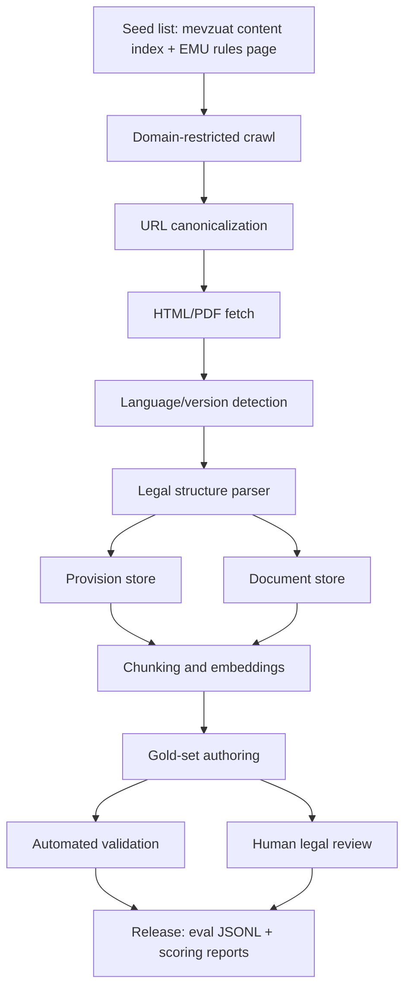
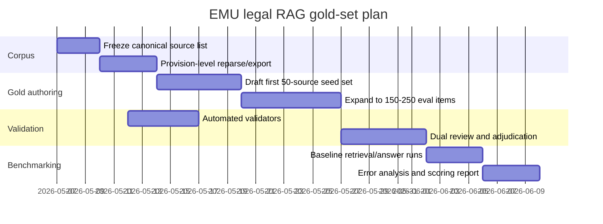

# Gold Evaluation Set Design for an EMU Legal RAG Demo

## Executive Summary

The right starting point for this RAG evaluation project is the official rules-and-regulations surface of mevzuat.emu.edu.tr, backed by the official institutional entry page on emu.edu.tr. The mevzuat content index exposes the main corpus layout by topic, including student regulations, graduate regulations, academic-staff rules, administrative-staff rules, dormitory rules, and other institutional regulations; the EMU site is the official parent page that points users to that corpus. citeturn10search3turn0search1

The current project is already past the hardest infrastructure phase. Your uploaded project state says the live crawl succeeded over 123 HTML pages and 22 PDFs, normalized into 119 source documents and 530 chunks, with crawler, parser, and chunk output already present. The uploaded progress plan also says the remaining work is primarily gold-set curation, expected-answer formatting, and evaluation wiring, not first-principles crawling. fileciteturn0file0 fileciteturn0file1 fileciteturn0file2

That matters because legal RAG fails for reasons that are different from ordinary QA. Recent legal-benchmark work shows that legal retrieval is still hard, especially when there is low lexical overlap, multi-hop reasoning is required, or the model must produce reliable citations; retrieval quality often dominates end-to-end legal RAG performance, and ungrounded generation remains a core failure mode. citeturn22search12turn22search0turn22search6

For this corpus, the gold set should therefore be built around **provision-level grounding**, not just document-level relevance. The corpus itself repeatedly signals an additional legal-risk issue: many English pages explicitly state that, if there is disagreement, the Turkish version is the valid reference source. That means a production-grade gold set must preserve both the raw page evidence and a canonical Turkish-reference path for adjudication. citeturn8search0turn8search2turn8search4turn10search1

The practical consequence is straightforward. The best gold set for this demo is **not** a generic list of plausible questions. It is a structured benchmark with: provision-level retrieval targets; exact article, paragraph, and clause citations; short authoritative quote spans; an explicit confidence label; separate scoring for retrieval, correctness, citation precision, and hallucination; and a validation workflow that mixes automated checks with human review. That design aligns both with the EMU corpus structure and with what recent legal-RAG research says actually breaks in deployment. citeturn10search3turn22search12turn22search0

The research start points used here, in the order you requested, were:

| Priority | Website | Role in the study |
|---|---|---|
| first | mevzuat.emu.edu.tr | primary normative corpus, index, and article-level source documents |
| second | emu.edu.tr | official institutional landing page that points users to rules and regulations |

These were then supplemented, where useful, by recent legal-RAG and legal-retrieval literature to shape the benchmark design and scoring model. citeturn10search3turn0search1turn22search12turn22search0

## Corpus and Parsing Methodology

The corpus on mevzuat.emu.edu.tr is the official rules-and-regulations corpus for entity["organization","Eastern Mediterranean University","Famagusta, Northern Cyprus"], and its content index exposes a stable top-level taxonomy: student regulations, graduate regulations, academic-staff regulations, administrative-staff regulations, dormitory and housing regulations, and related institutional rules. That top-level organization should be preserved as the first metadata layer in the index. citeturn10search3

Your current repository state already indicates a working crawl/parse/chunk pipeline, so the recommended next-step method is an **incremental legal-grade re-index**, not a full redesign. Concretely: re-crawl from the existing seed set, preserve current normalized source IDs, re-parse each document into article/paragraph/clause units, and then rebuild retrieval views for both document-level and provision-level search over the same canonical source store. fileciteturn0file0 fileciteturn0file1 fileciteturn0file2

A defensible crawl strategy for this site is:



### Crawling and indexing rules

The crawl should begin from the EMU rules page and the mevzuat content index because those pages define the institution-approved surface area and category boundaries. The content index is especially valuable because it reveals titles that may not otherwise rank well in search and it groups related regulations under stable section numbers like 5.1, 5.4, 6.1, 7.1, and 8.1. citeturn10search3turn0search1

Canonicalization should normalize at least four things. First, normalize duplicate URL encodings and mixed-title variants. Second, preserve both Turkish and English renderings when they are different URLs to the same instrument. Third, mark “content index” pages as index pages, not normative instruments. Fourth, mark document variants that are clearly parallel language or legacy-format pages as separate crawl targets but related canonical instruments. This matters because the site contains separate paths for older or alternate renderings, including Turkish-only pages and English pages with a disclaimer that the Turkish text controls in case of conflict. citeturn11search1turn11search2turn19search1turn19search2

The index should expose **two retrieval granularities** by default: a document-level index for broad recall and a provision-level index for legal answer generation. Recent legal-retrieval work is clear that legal QA and legal citation tasks degrade badly if retrieval units are too coarse or too noisy, especially when answers depend on a specific subsection rather than a document theme. citeturn22search12turn22search0

### Metadata schema

The metadata should be richer than standard RAG metadata because legal QA needs auditability.

| Field | Type | Purpose |
|---|---|---|
| `doc_id` | string | stable canonical document ID |
| `source_url` | string | exact crawled URL |
| `canonical_instrument_id` | string | links language/version variants to one instrument |
| `title_raw` | string | raw page title as published |
| `title_normalized` | string | normalized title for retrieval/display |
| `corpus_section` | string | top-level section from content index, e.g. `5.1`, `6.3.3` |
| `instrument_family` | enum | student, graduate, academic_staff, admin_staff, dormitory, housing, research, school, institute, other |
| `language` | enum | `tr`, `en`, `mixed` |
| `is_translation` | boolean | whether page is an English rendering of Turkish text |
| `translation_disclaimer` | boolean | mark pages stating Turkish version controls |
| `authority_raw` | string | raw issuing-body string if present |
| `legal_basis_raw` | string | raw basis line, e.g. “Regulation under Article 32” |
| `amendment_history_raw` | array[string] | raw inline amendment markers as printed |
| `publication_reference_raw` | string | Official Gazette or similar publication string if present |
| `effective_rule_raw` | string | “Coming into Force” or equivalent raw text |
| `article_no` | string | article number, including Roman or Arabic reference |
| `article_heading` | string | article rubric, e.g. Aim, Scope, Tuition Fees |
| `paragraph_no` | string | paragraph number within article |
| `clause_label` | string | `(a)`, `(b)`, `(1)` etc. |
| `segment_type` | enum | title, preamble, article, paragraph, clause, table, appendix, temporary_provision, final_provision |
| `quote_text` | string | exact extracted text span |
| `quote_start_char` | int | provenance offset |
| `quote_end_char` | int | provenance offset |
| `cross_refs_raw` | array[string] | cited internal/external regulations |
| `issuer_jurisdiction` | string | EMU internal, faculty-specific, institute-specific, etc. |
| `unit_scope` | string | faculty, institute, dormitories, rectorate, etc. |
| `chunk_id` | string | retrieval chunk mapping |
| `version_hash` | string | content hash for drift detection |
| `review_status` | enum | drafted, auto_checked, human_checked, adjudicated |
| `gold_confidence` | enum | high, medium, low |

### Legal parsing rules

The parser should treat these documents as **hierarchical legal instruments**, not generic webpages. The recurring structure across the corpus is stable enough to parse reliably: short title or brief title, aim, scope, definitions or description, main provisions, temporary provisions, executive power, and coming into force. That pattern appears repeatedly across student, graduate, staff, and dormitory instruments. citeturn8search2turn9search4turn10search1turn11search0turn12search0

The parser should apply these rules.

First, parse the **legal header block** separately. Many documents carry issuing authority, statutory basis, and amendment history before the substantive provisions. These are not article text, but they are critical metadata for date-aware and amendment-aware questions. The corpus also frequently preserves raw amendment tokens such as `SEN`, `VYK`, `ÜYK`, and `R.G.` inline with article headings or title lines. Those strings should be stored losslessly in `amendment_history_raw`. citeturn9search4turn11search0turn11search2turn12search0

Second, split articles by the printed article number, even if the site formatting is inconsistent. Many pages use formats like `| 1. |`, `ARTICLE 1`, or mixed heading-plus-table layouts. The parser should prefer regexes anchored to article numbers plus strong lexical cues such as `Aim`, `Scope`, `Definitions`, `Executive Power`, and `Coming into Force`. citeturn8search0turn14search1turn16search1

Third, parse subordinate units hierarchically. Use this precedence: article > paragraph `(1)` > clause `(a)` > subclause `(i)`. Preserve the exact label string, because many gold answers will depend on a clause-level citation such as Article 7(9) rather than just Article 7. That is especially important in disability accommodations, scholarship conditions, and disciplinary provisions. citeturn14search3turn10search0turn18search0

Fourth, treat **tables and appendices** as first-class legal segments. The corpus includes tables for grades, score systems, and staff scales, and appendices for dormitory contracts and required documents. These should be indexed with their own `segment_type`, not flattened into generic prose. citeturn8search5turn12search0

Fifth, explicitly model **temporary provisions** and **final provisions**. In legal QA, those sections are often where effective dates, transition rules, and supersession logic live. The EMU corpus uses these sections regularly, especially in fees, graduate rules, staff rules, and housing rules. citeturn14search1turn8search3turn13search0turn12search0

Sixth, mark translation status. Because many English pages state that the Turkish text controls, the gold set should treat English answers as user-facing renderings and Turkish text as adjudication fallback whenever the two diverge. That is not optional for a serious legal demo. citeturn8search0turn8search2turn8search4turn10search1

### Retrieval and chunking recommendations

For a legal demo, use **structure-aware chunking**. One chunk per article is the default. If an article is long, split by paragraph or clause while preserving the full citation path in metadata. Keep overlap small because legal provisions often become ambiguous when split across labels rather than sentences. The target is not semantic smoothness; it is citation stability. Recent legal-RAG work supports structure-aware retrieval and warns against treating legal tasks as ordinary open-domain QA. citeturn22search12turn22search0

Given your current repo state, keep the existing document-level chunk artifacts, but add a second “gold-authoring” export where each JSONL line is a provision with explicit `article_no`, `paragraph_no`, `clause_label`, and `quote_text`. That lets you evaluate retrieval and answering separately without rebuilding the whole system. fileciteturn0file0 fileciteturn0file1

## Evaluation Taxonomy

The benchmark should cover eight prompt families. That is the minimum if you want to expose real legal-RAG strengths and failures rather than just keyword retrieval. The categories below are derived from the structure of the EMU corpus and from recent legal-retrieval literature showing the need to test retrieval, provision grounding, reasoning depth, and hallucination behavior separately. citeturn10search3turn22search12turn22search0

### Fact retrieval

**Easy**
- **E1**: “What is the brief title of the regulation in Article 1?”
- **E2**: “According to Article X, what is the aim of this regulation?”

**Medium**
- **M1**: “Who is covered by this regulation under the scope article?”
- **M2**: “What is the maximum/minimum threshold stated in Article X(Y)?”
- **M3**: “Which office/body is responsible for execution under the final provisions?”

**Hard**
- **H1**: “Extract the precise eligibility conditions in Article X with all listed sub-conditions.”
- **H2**: “Which article states the deadline, and what exactly is the deadline?”
- **H3**: “Return the answer as `{rule, threshold, exception}` using the cited clause only.”

### Citation accuracy

**Easy**
- **E1**: “Answer with the article number only: where is the tuition-fee rule stated?”
- **E2**: “Give the article and paragraph that defines ‘student advisor.’”

**Medium**
- **M1**: “Which exact clause supports the statement that Turkish version controls if translations conflict?”
- **M2**: “Cite the article and subclause governing extra time in exams for students with disabilities.”
- **M3**: “Find the provision that sets the maximum period of study.”

**Hard**
- **H1**: “Provide the answer with exact citation in the format `Art. X(Y)(z)` and a 5–12 word quote.”
- **H2**: “Two nearby provisions look relevant. Cite only the provision that directly answers the question.”
- **H3**: “Return the smallest sufficient citation span, not the whole article.”

### Summarization

**Easy**
- **E1**: “Summarize the aim and scope of this regulation in two sentences.”
- **E2**: “Summarize Article X for a first-year student.”

**Medium**
- **M1**: “Summarize the main obligations of students under Articles X–Y.”
- **M2**: “Summarize the disciplinary penalty ladder without omitting any level.”
- **M3**: “Summarize the fee rules and clearly separate cases for undergraduate vs postgraduate students.”

**Hard**
- **H1**: “Write a plain-English summary that preserves all conditions and exceptions.”
- **H2**: “Summarize only the parts relevant to a student requesting exemption after transfer.”
- **H3**: “Produce a 5-bullet compliance summary with one citation per bullet.”

### Contradiction detection

**Easy**
- **E1**: “Does this claim match the regulation: ‘all graduate seminar courses are always free’?”
- **E2**: “True or false: ‘students with debts can still receive official documents.’”

**Medium**
- **M1**: “Which part of the claim is wrong, and which clause refutes it?”
- **M2**: “Compare these two statements and identify which one conflicts with the regulation.”
- **M3**: “Does the summary omit an exception that changes the legal result?”

**Hard**
- **H1**: “Check whether Statement A and Statement B can both be true under the regulation.”
- **H2**: “Find the minimal contradiction: the exact phrase in the claim that is unsupported.”
- **H3**: “If the claim is partly right and partly wrong, separate supported and contradicted parts with citations.”

### Multi-hop reasoning

**Easy**
- **E1**: “If a student takes courses from another institution, which separate regulation governs equivalency?”
- **E2**: “Which graduate-fee rule points to the tuition-fee regulation for leave/cancellation cases?”

**Medium**
- **M1**: “A student transfers in, requests exemptions, and asks about transcript treatment. Which two regulations apply?”
- **M2**: “Which regulation defines admissions, and which regulation defines later exemptions?”
- **M3**: “Trace the rule chain from graduate registration to graduate studies to diploma issuance.”

**Hard**
- **H1**: “Answer the question only after combining provisions from two or more regulations.”
- **H2**: “Resolve a scenario involving fees, leave of absence, and course registration using cross-references.”
- **H3**: “Return a step-by-step legal path: `{issue -> regulation -> article -> consequence}`.”

### Temporal and amendment-aware queries

**Easy**
- **E1**: “What does the current page say is the latest amendment marker for this regulation?”
- **E2**: “Which article says when the regulation comes into force?”

**Medium**
- **M1**: “Identify whether this rule is subject to a temporary provision.”
- **M2**: “Which provision applies specifically to students registering after a stated academic year?”
- **M3**: “List the transition rule and the date or academic term attached to it.”

**Hard**
- **H1**: “A rule changed after 2018. Which article shows the transition condition?”
- **H2**: “The user asks about the ‘current’ rule. Use the most recent visible amendment/version, not an older duplicate page.”
- **H3**: “Compare an old dormitory rule with the current rule and flag the changed refund or accommodation logic.”

### Jurisdictional scope

**Easy**
- **E1**: “Is this an EMU-wide regulation, a faculty-specific rule, or an institute-specific rule?”
- **E2**: “Which unit executes this regulation?”

**Medium**
- **M1**: “Does this rule apply to all students or only to graduate students?”
- **M2**: “Is this provision limited to the Medicine Faculty or applicable university-wide?”
- **M3**: “Which office has decision power: Faculty Board, Senate, or Rector’s Office?”

**Hard**
- **H1**: “For this scenario, identify the governing institution level and why.”
- **H2**: “Separate university-level rules from faculty-level rules when both are cited in the same answer.”
- **H3**: “Return `{jurisdiction, competent body, affected population}` with evidence.”

### Language and translation checks

**Easy**
- **E1**: “Translate the article title into English while keeping the legal meaning.”
- **E2**: “What is the English equivalent of this Turkish article heading?”

**Medium**
- **M1**: “Does the English rendering preserve the legal threshold from the Turkish text?”
- **M2**: “Find the Turkish phrase corresponding to this English answer span.”
- **M3**: “Explain whether the translation changes the operative legal effect.”

**Hard**
- **H1**: “The English page says Turkish text controls. Answer in English but flag that the Turkish source is authoritative.”
- **H2**: “Where the English page uses a summary-like translation, extract the more literal governing phrase.”
- **H3**: “Return `{english_answer, turkish_quote, warning_if_translation_controls}`.”

## Proposed Gold Set

The table below proposes a **50-example seed gold set** anchored to directly inspected source documents/URLs on mevzuat.emu.edu.tr. I prioritized breadth across student, graduate, staff, research, disability, administrative, and housing/dormitory topics. A few representative areas of the corpus remain under-sampled because some pages were sparsely indexed or only partially visible during source inspection; those are listed later under limitations. The set below is still large enough to drive a serious demo and to expose retrieval, citation, and hallucination failures early. citeturn10search3

### Gold examples

| Label | Source document | Prompt | Gold expected answer | Length / format | Confidence |
|---|---|---|---|---|---|
| G-01 | Education, Examinations and Success — Art. 1. citeturn8search4 | What is the brief title of the university-wide education by-law? | **Art. 1** states the title is **“Regulation for Eastern Mediterranean University Education, Examinations and Success.”** Quote: “Regulation for … Education, Examinations and Success.” | short extract | High |
| G-02 | Education, Examinations and Success — Art. 34. citeturn8search4 | When does this regulation come into force? | **Art. 34** says the regulation comes into force **following its publication in the Official Gazette**. Quote: “following its publication in the Official Gazette.” | one sentence + cite | High |
| G-03 | Entrance Exam and Student Admission — Art. 4. citeturn20search3 | What is the baseline school-completion requirement for admission? | **Art. 4** requires applicants to be **graduates of a high school or equivalent secondary institution**. Quote: “graduates of a high school or any other equivalent secondary institution.” | short extract | High |
| G-04 | Entrance Exam and Student Admission — Art. 13(2). citeturn20search3 | What must non-Turkish-native foreign students show to transfer into Turkish-medium programs? | **Art. 13(2)** requires them to **certify sufficient Turkish knowledge through a Turkish proficiency exam of the relevant institutions/units**. Quote: “required to certify that their knowledge of Turkish language is sufficient.” | one sentence + cite | High |
| G-05 | Scholarship and Discounted Tuition Fee Implementation. citeturn20search8 | What does the EMU entrance-exam scholarship cover, and how long does it last? | The rule says the scholarship includes **tuition-fee exemption** and lasts for the **standard study period**, with **one additional preparatory year if needed**. Quote: “includes exemption from tuition fees” and “standard period of study.” | structured short answer | High |
| G-06 | Vertical Transfer Preparation Program — Art. 5(b). citeturn8search6 | How large must the vertical-transfer preparatory package be? | **Art. 5(b)** says the package program must correspond to **70±2% of the total credit load of the first four semesters** of the undergraduate program. Quote: “70±2% of the total credit load.” | numeric threshold | High |
| G-07 | Vertical Transfer Preparation Program — Art. 6(c). citeturn8search6 | What is the maximum study period in the vertical-transfer preparation program? | **Art. 6(c)** sets the maximum period at **three semesters**. Quote: “The maximum period of study … is three semesters.” | short extract | High |
| G-08 | Examinations and Evaluation — Art. 5. citeturn8search0 | How many mid-terms may be given in a semester? | **Art. 5** allows **a minimum of 1 and a maximum of 3 mid-terms** per course in each academic semester. Quote: “a minimum of 1 and a maximum of 3.” | short extract | High |
| G-09 | Examinations and Evaluation — Art. 6(3). citeturn8search0 | How quickly must final exam papers be evaluated? | **Art. 6(3)** says final examination papers must be evaluated **within 5 days following the exam date**. Quote: “within 5 days following the exam date.” | short extract | High |
| G-10 | Course Registration — Art. 3. citeturn9search4 | Who is appointed for each enrolled student, and for what purpose? | **Art. 3** requires appointment of **a student advisor who is a member of the academic staff** to guide the student in **course registration and other academic, administrative, and social matters**. Quote: “a student advisor … is appointed.” | one sentence + cite | High |
| G-11 | Taking Courses from Another Institution — Art. 3(3). citeturn9search0 | What is the credit ceiling for courses taken from another institution? | **Art. 3(3)** caps such credits at **25% of the course credits the student must take in the associate/undergraduate program**. Quote: “cannot exceed 25%.” | numeric threshold | High |
| G-12 | Taking Courses from Another Institution — Art. 3(8). citeturn9search0 | What minimum CGPA is normally required before taking courses from another institution? | **Art. 3(8)** requires the student to have completed **at least one academic year** and to have **a minimum CGPA of 2.00**. Quote: “minimum CGPA of 2.00.” | short extract | High |
| G-13 | Double-Major Programs — Art. 2. citeturn9search1 | What is the purpose of the undergraduate double-major regulation? | **Art. 2** says it enables successful undergraduate students to obtain **the diploma of another undergraduate program**, either in the same faculty or another faculty, subject to wish and admission. Quote: “obtain the diploma of another undergraduate program.” | one sentence summary | High |
| G-14 | Minor Programs — Art. 3. citeturn21search5 | What is the purpose of the minor-program regulation? | **Art. 3** says the regulation sets principles for admission and registration of successful major-program students who want to **improve their knowledge in another program of interest**. Quote: “improve their knowledge at another program of interest.” | one sentence summary | High |
| G-15 | Summer School — Art. 3. citeturn9search5 | What are the two main purposes of summer school? | **Art. 3** gives at least two core purposes: helping students become **regular** after failing courses and helping successful students **complete the program in less than the normal period**. Quote: “become regular” and “less than the normal period.” | 2-bullet answer | High |
| G-16 | Tuition Fees — Art. 5. citeturn8search2 | When are annual tuition fees determined? | **Art. 5** says annual tuition fees are determined by the **Board of Trustees before the announcement of the entrance exams** and then announced by the Rector’s Office. Quote: “before the announcement of the entrance exams.” | one sentence + cite | High |
| G-17 | Student Advisorship — Art. 5. citeturn21search2 | What is the aim of student advisorship at EMU? | **Art. 5** says student advisorship is meant to help students solve mainly **academic problems**, provide **guidance**, support **course selection**, and monitor **academic performance and success**. Quote: “help students in solving the problems they may encounter primarily in academic areas.” | short summary | High |
| G-18 | Exemptions and Equivalency — Art. 4(1). citeturn9search3 | When must exemption applications be submitted? | **Art. 4(1)** says applications must be submitted **by the end of the add/drop period or within 15 working days after registration** to the admitted program. Quote: “within 15 working days.” | date/deadline answer | High |
| G-19 | Student Disciplinary Code — Art. 5(3). citeturn10search0 | What does short-term suspension mean under the disciplinary code? | **Art. 5(3)** defines short-term suspension as a written sanction barring the student from academic activities for **1 to 15 days**. Quote: “from 1 to 15 days.” | short extract | High |
| G-20 | Dr. Fazıl Küçük Medicine Faculty Regulation — Art. 10. citeturn20search5 | What is the duration of the medicine program, and how is it split? | **Art. 10** says the program lasts **6 years**, with the **first 3 years at EMU** and the **remaining 3 years at entity["organization","Marmara University","Istanbul university"]**. Quote: “The first three years … the remaining three years.” | short extract | High |
| G-21 | Medicine Faculty Regulation — Art. 13(3). citeturn20search5 | Which students must pass Turkish proficiency by the end of the third year? | **Art. 13(3)** applies that requirement to **international students** and students whose secondary education outside the TRNC/Turkey was in a language other than Turkish. Quote: “required to demonstrate successful performance from the Turkish Proficiency Test by the end of the 3rd year.” | scoped answer | High |
| G-22 | Graduate Programs, Registration and Admission. citeturn10search1 | What baseline academic metrics are stated for applicants applying with an undergraduate diploma? | The regulation states that such candidates must have **minimum 3.00/4.00 graduation average**, and citizens of Turkey must have **minimum 80 ALES or equivalent GMAT/GRE**. Quote: “minimum 3.00 out of 4.00” and “minimum 80 from ALES.” | short structured answer | High |
| G-23 | Graduate Programs, Registration and Admission — Art. 10(2)(c). citeturn10search1 | What is the maximum amount of exempted credit that can transfer into a graduate program? | **Art. 10(2)(c)** says transferred exempted course credits can be equivalent to **only half of the credits necessary to complete the program**. Quote: “only be equivalent to half.” | numeric threshold | High |
| G-24 | Graduate Studies and Examinations — Art. 4(3). citeturn20search1 | What course must be offered during graduate studies? | **Art. 4(3)** requires at least **one course on scientific research techniques and research/publication ethics**. Quote: “Minimum one course on scientific research techniques and research and publication ethics.” | short extract | High |
| G-25 | Graduate Studies and Examinations — Art. 28(3). citeturn20search1 | How is the graduation date defined for thesis vs non-thesis graduate programs? | **Art. 28(3)** says for thesis master’s and PhD programs the date is when the signed thesis copy is submitted by the jury, while for non-thesis programs it is when graduation conditions are fulfilled. Quote: “the date when the signed copy of thesis is submitted.” | compare/contrast | High |
| G-26 | Research Assistants and Postgraduate Scholarships — Art. 4(1). citeturn11search3 | What is Category A research assistantship? | **Art. 4(1)** defines Category A as a full-time research assistant category for doctoral students, including some doctoral students at another university with relevant unit decision, and it also requires passing the doctoral qualifying exam. Quote: “Passing the Doctoral Degree Qualifying Examination is another requirement.” | short summary | High |
| G-27 | Research Assistants and Postgraduate Scholarships — Art. 10(4). citeturn11search3 | What minimum CGPA is required for newly registered students to be appointed full-time research assistants? | **Art. 10(4)** requires **minimum CGPA 3.00/4.00 or equivalent**, plus success in the oral and/or written exam. Quote: “minimum CGPA of 3.00 out of 4.00.” | numeric threshold | High |
| G-28 | Distance Postgraduate Education Programs — Art. 10(1)–(2). citeturn15search0 | What is the assessment split between online coursework and final exams in distance postgraduate programs? | **Art. 10(1)–(2)** says online mid-terms/homework/project work may not exceed **50%** of the total evaluation, and **final exams are at least 50%** of the total grade. Quote: “cannot exceed 50%” and “at least 50%.” | numeric threshold | High |
| G-29 | Graduate Program Fee Application — Art. 3(3). citeturn14search1 | Is the first registration to a non-credit seminar course charged? | **Art. 3(3)** says first registration to the non-credit seminar course is **free of charge**; re-registration after failure costs **20% of the fee of a postgraduate course**. Quote: “is free of charge.” | boolean + exception | High |
| G-30 | Double Major Graduate Programs — Art. 7(1). citeturn10search2 | What is the duration of the double-major graduate degree program? | **Art. 7(1)** sets the duration at **minimum four and maximum eight semesters**. Quote: “minimum four and maximum eight semesters.” | short extract | High |
| G-31 | Education and Exam Applications for Students with Disabilities — Art. 7(9). citeturn14search3 | How much extra exam time is granted in the listed disability cases? | **Art. 7(9)** grants **two-third of the exam duration as extra time allowance** in the cases listed there. Quote: “Two-third of the exam duration.” | numeric threshold | High |
| G-32 | Disabled Students Unit Principles — Arts. 5–6. citeturn14search0 | What is the unit supposed to do? | The principles say the unit, operating under the Rector’s Office, identifies disabled students’ **academic, administrative, physical, social, and accommodation-related needs**, plans action, and coordinates measures and support. Quote: “identifies the needs … and specifies, plans, implements and develops action.” | short summary | High |
| G-33 | Foreign Languages and English Preparatory School — Art. 7(1). citeturn20search0 | What is the standard duration of the English preparatory program? | **Art. 7(1)** says the standard duration is **1 academic year**, and each academic year consists of **2 semesters**. Quote: “1 academic year” and “2 semesters.” | short extract | High |
| G-34 | Staffing and Employment for Academic Staff — Art. 3. citeturn16search4 | What does the academic-staff staffing by-law regulate? | **Art. 3** says it regulates the number of academic staff, their **working conditions, qualifications, duties, salaries, allowances, appointments, approvals, promotions, pension rights, personnel procedures, and disciplinary procedures**. Quote: “their working conditions, qualifications, duties … and disciplinary procedures.” | one sentence summary | High |
| G-35 | Weekly and Extra Course-Load Calculation — para. 1. citeturn21search0 | How is annual course load defined? | The principles define annual course load as **the sum of the weekly course load in the fall and spring semesters** of the academic year. Quote: “the sum of the weekly course load in the fall and spring semesters.” | short extract | High |
| G-36 | Scientific Research and Publication Ethics — Art. 5(1). citeturn11search2 | What five basic values underlie the university’s academic ethics principles? | **Art. 5(1)** lists **Honesty, Trust, Justice, Respect, Responsibility**. Quote: “five basic values.” | 5-item list | High |
| G-37 | Scientific Research and Publication Ethics — Art. 9. citeturn11search2 | What are some duties of the Scientific Research and Publication Ethics Board? | **Art. 9** includes ensuring ethical appropriateness of scientific research, investigating ethical-violation applications, deciding appeals from sub-committees, and examining unethical behavior in university-supported research projects. Quote: “investigating and finalising the applications regarding the ethical violations.” | 3-bullet summary | High |
| G-38 | Appointment of Academic Staff — Art. 13. citeturn16search0 | How long do candidates have to appeal appointment results? | **Art. 13** gives candidates **15 days** after announcement of results to appeal to the Rector’s Office. Quote: “within 15 days.” | short extract | High |
| G-39 | Academic Staff Title By-law — Art. 4. citeturn16search2 | Is English proficiency required for appointments in English-medium departments? | **Art. 4** says yes: proficiency in English is a requirement for academic staff appointed to **English-medium departments**. Quote: “proficiency in English is one of the requirements.” | yes/no + cite | High |
| G-40 | Academic Evaluation Criteria — General Rule 2. citeturn16search3 | What counts as a “national” or “domestic” event under the academic evaluation criteria? | General Rule 2 says such events are those taking place in **Turkey, the TRNC, or the staff member’s home country**, provided they are not regarded as international events. Quote: “Turkey, TRNC or home country.” | short extract | Medium |
| G-41 | Scientific Research Support Principles — Art. 11(1)–(3). citeturn21search3 | What is the difference between Type A, Type B, and Type C scientific research projects? | Type A is fully funded by EMU research budget; Type B is externally funded or co-funded, including TÜBİTAK/EU projects; Type C is EMU-budget-funded and thesis-supervisor/postgraduate-student oriented to build research culture. Quote: “Type A,” “Type B,” “Type C.” | structured compare/contrast | High |
| G-42 | Type C Scientific Research Projects Application Principles — Arts. 4 and 7. citeturn21search1 | What is the maximum project period, and how can it be extended? | **Art. 4(2)** sets a maximum period of **1 year**, and **an extension of 6 months may be granted twice at most**. Quote: “maximum 1 year” and “6 months … two times at most.” | numeric threshold | High |
| G-43 | Researcher Incentive Principles — Art. 9(2). citeturn16search1 | What minimum score must an academic staff member have to apply for the researcher incentive award? | **Art. 9(2)** requires at least **60 incentive points from at least 3 activity areas**. Quote: “minimum sixty (60) incentive points obtained from minimum three (3) activity areas.” | numeric threshold | High |
| G-44 | DÖSAP Appointment Principles — Arts. 3–4. citeturn16search5 | When can course-based special-contract academic personnel be appointed? | The principles say DÖSAP appointments may be used when **the number of full-time academic staff is insufficient** and/or when the university wants students to benefit from **prominent persons in their fields** from within or outside the TRNC. Quote: “full-time academic staff falls insufficient.” | scoped summary | High |
| G-45 | Staffing and Employment for Administrative Staff — Art. 44(1). citeturn17search1 | What are the regular working-hours rules for administrative services personnel? | **Art. 44(1)** sets working hours at **forty hours per week**, excluding **Saturday and Sunday**, with hours determined by the Rector’s Office and rotation possible when needed. Quote: “forty hours per week.” | short extract | High |
| G-46 | Principles for Appointment, Promotion and Awarding of Administrative Services Staff — item 5. citeturn17search2 | What documents must a candidate submit before employment starts? | The appointment notification requires a written acceptance, **ID photocopy, health report, and 6 passport-size photos**. Quote: “health report” and “6 passport size photos.” | short checklist | High |
| G-47 | Administrative Services Staff Performance Evaluation — Art. 10. citeturn18search1 | When is the annual performance evaluation form completed? | **Art. 10** says the form is completed **once every year in September** by the relevant evaluation/sicil superior. Quote: “yılda bir kez Eylül ayında.” | date/deadline answer | High |
| G-48 | Administrative Services Staff Disciplinary Regulation — Art. 4(a). citeturn18search0 | Give one example of conduct that can lead to a warning penalty. | One listed example is **arriving late or leaving early without excuse or permission**. Quote: “özürsüz veya izinsiz olarak göreve geç gelmek veya görevden erken ayrılmak.” | one-example answer | High |
| G-49 | Regulations and Principles for Student Dormitories — Art. 5(1). citeturn12search1 | Who may stay in EMU and BOT dormitories? | **Art. 5(1)** says students wishing to stay in EMU and BOT dormitories **must be registered students of the University**. Quote: “should be registered students.” | yes/no eligibility | High |
| G-50 | Benefiting from University Housing and Guest House Facilities — Art. 7. citeturn13search0 | What is the maximum regular occupancy period for university housing? | **Art. 7** sets the maximum period at **6 years**, with a possible **extension of up to 3 more years for special conditions** upon recommendation and approval. Quote: “maximum period … 6 years” and “another period of three years.” | numeric threshold | High |

### Mapping documents to answer format and expected length

The benchmark should deliberately vary answer shape, not just question content. A realistic legal RAG demo must answer differently depending on task.

| Format | Use when | Expected length |
|---|---|---|
| `short_extract` | direct threshold, title, date, authority | 1 sentence or 5–20 words |
| `one_sentence_rule` | direct rule with one condition | 1 sentence |
| `scoped_summary` | when answer must specify who is covered | 1–2 sentences |
| `compare_contrast` | cross-category comparisons, e.g. thesis vs non-thesis | 2–4 bullets |
| `checklist` | document requirements, penalty ladders, obligations | 3–7 bullets |
| `boolean_with_cite` | contradiction checks / true-false prompts | `Yes/No + one-sentence justification` |
| `structured_json` | machine-consumable demo mode | 3–8 fields |
| `citation_only` | retrieval-only or citation-precision tests | exact article path only |

### Sample JSONL schema

Each JSONL line should be **one evaluation case**, not one document. A single document can yield multiple evaluation cases. The schema below is the minimum useful version.

```json
{
  "eval_id": "EMU-G-031",
  "source_doc_id": "5-4-7-RegEduExamAppStdwD",
  "source_url": "https://mevzuat.emu.edu.tr/5-4-7-RegEduExamAppStdwD.htm",
  "language": "en",
  "canonical_language": "tr_if_conflict",
  "prompt_type": "fact_retrieval",
  "difficulty": "medium",
  "user_prompt": "How much extra exam time is granted to certain students with disabilities?",
  "expected_answer": {
    "answer_text": "Article 7(9) grants two-third of the exam duration as extra time allowance in the listed cases.",
    "citations": [
      {
        "article": "7",
        "paragraph": "9",
        "clause": null,
        "quote_span": "Two-third of the exam duration"
      }
    ],
    "answer_format": "short_extract",
    "confidence": "high"
  },
  "retrieval_targets": [
    {
      "article": "7",
      "paragraph": "9",
      "clause": null
    }
  ],
  "grading": {
    "must_include": ["two-third", "exam duration", "Article 7(9)"],
    "must_not_include": ["full extra exam", "double time"],
    "partial_credit_rules": {
      "correct_rule_wrong_citation": 0.7,
      "correct_citation_incomplete_rule": 0.8
    }
  }
}
```

```json
{
  "eval_id": "EMU-G-043",
  "source_doc_id": "6-3-5-ResearcherIncentivePrinciples",
  "source_url": "https://mevzuat.emu.edu.tr/6-3-5-Researcher%20Incentive%20Principles.htm",
  "language": "en",
  "canonical_language": "tr_if_conflict",
  "prompt_type": "citation_accuracy",
  "difficulty": "medium",
  "user_prompt": "What minimum score is required to apply for the Researcher Incentive Award?",
  "expected_answer": {
    "answer_text": "Article 9(2) requires at least 60 incentive points from at least 3 activity areas.",
    "citations": [
      {
        "article": "9",
        "paragraph": "2",
        "clause": null,
        "quote_span": "minimum sixty (60) incentive points obtained from minimum three (3) activity areas"
      }
    ],
    "answer_format": "one_sentence_rule",
    "confidence": "high"
  },
  "retrieval_targets": [
    {
      "article": "9",
      "paragraph": "2",
      "clause": null
    }
  ],
  "grading": {
    "must_include": ["60", "3 activity areas"],
    "must_not_include": ["50", "2 activity areas"]
  }
}
```

## Scoring and Validation

Legal demo evaluation should separate **retrieval failure** from **answer failure**. If you merge them into one scalar, you will not know whether the system is weak because it found the wrong article, paraphrased badly, or hallucinated a citation. That distinction is exactly what recent legal-RAG work argues for. citeturn22search12turn22search0turn22search4

### Scoring rubric

| Dimension | Weight | What gets full credit | Partial credit | Zero credit |
|---|---:|---|---|---|
| retrieval correctness | 0.30 | retrieves the exact target article/paragraph/clause in top-k | retrieves correct article but wrong paragraph/clause, or relevant neighboring provision | misses governing provision |
| answer correctness | 0.30 | legal rule is materially correct and complete | right rule but incomplete exception/threshold; or right outcome with weak scope statement | wrong rule/outcome |
| citation precision | 0.20 | exact provision citation path and quote span | article-only when clause needed; or clause right but quote span sloppy | fabricated or unsupported citation |
| groundedness / hallucination | 0.15 | every material claim grounded in retrieved provision | one minor unsupported phrase without changing legal result | invented rule, invented exception, invented threshold |
| format compliance | 0.05 | matches requested format exactly | small formatting deviations | unusable output |

Total score:

\[
\text{Total} = 0.30R + 0.30A + 0.20C + 0.15G + 0.05F
\]

Where:
- \(R\) = retrieval score
- \(A\) = answer correctness
- \(C\) = citation precision
- \(G\) = groundedness / hallucination
- \(F\) = format compliance

### Retrieval metrics

Use the usual IR metrics, but compute them at the **provision level**, not just document level.

| Metric | Why it matters |
|---|---|
| Recall@1 / @3 / @5 | whether the system can surface the governing article quickly |
| MRR | useful for demo latency and user trust |
| nDCG@k | useful when several related provisions are retrieved |
| exact provision hit rate | the key legal retrieval metric for this project |
| article-family hit rate | fallback metric when paragraph-level extraction is noisy |

### Answer metrics

For answering, use a mix of rule-based and human-judged checks.

| Metric | Rule |
|---|---|
| exact citation match | exact `Art. X(Y)(z)` match |
| normalized answer match | compare after number/date/whitespace normalization |
| quote-span overlap | token overlap between expected quote and returned quote |
| contradiction penalty | subtract when answer conflicts with target provision |
| unsupported-claim count | count claims not tied to retrieved evidence |
| abstention correctness | reward refusal if retrieval misses governing rule |

### Hallucination rules

A legal answer is hallucinated if any of the following happens:
- it cites a non-existent article, paragraph, or clause;
- it invents a threshold, deadline, exception, or authority body;
- it attributes a rule from one regulation to another;
- it fails to signal uncertainty where the source visibility is incomplete or translation authority is contested.

### Partial-credit rules

Be explicit. Do not leave this to reviewer mood.

| Situation | Score guidance |
|---|---|
| correct rule, wrong citation | cap at 0.70 |
| correct citation, incomplete answer | cap at 0.80 |
| right article, wrong paragraph | cap retrieval at 0.60 |
| article-only citation where clause required | cap citation precision at 0.50 |
| correct answer but with one material unsupported statement | groundedness max 0.50 |
| unsupported answer recovered by correct abstention in a second pass | reward abstention rather than penalize as full failure |

### Validation plan

The validation pipeline should have three layers.

The first layer is **automated structural validation**. Check that every gold item has a non-empty prompt, source doc ID, exact citation path, quote span, answer text, format label, and confidence value. Check that article numbers referenced in the gold item exist in the parsed provision store. Check that quote text is actually present in the source segment after normalization. These are cheap and should run on every commit.

The second layer is **human annotation review**. Use two reviewers per item for the first 100–150 gold items. One reviewer should focus on legal fidelity and source sufficiency; the other should focus on answer usability and citation exactness. Any disagreement on article/paragraph or quoted span goes to adjudication. Because many English pages defer to Turkish text as controlling, the adjudicator should inspect the Turkish version whenever conflict exists. citeturn8search0turn8search2turn10search1

The third layer is **spot-checking in the running system**. On every major retrieval or prompt-template change, run a fixed sentinel suite:
- 10 threshold queries,
- 10 date/effective-date queries,
- 10 citation-only queries,
- 10 contradiction checks,
- 10 amendment/temporary-provision queries.

If sentinel performance drifts downward, block release.

## Deliverables, Timeline, and Open Questions

The current project state makes the next deliverables obvious. You do not need another month of crawler work. You need gold-set production, validators, and score reporting layered on top of the existing crawl/parse/chunk outputs already documented in the repo state and repo map. fileciteturn0file0 fileciteturn0file1 fileciteturn0file2

### Recommended deliverables

| Deliverable | Description |
|---|---|
| `eval_sets/emu_gold_v1.jsonl` | first adjudicated gold set, 150–250 eval cases built from the 50-source seed above |
| `eval_sets/emu_holdout_v1.jsonl` | withheld cases for regression testing |
| `demo_corpus/provisions.jsonl` | provision-level export with article/paragraph/clause metadata |
| `docs/eval_spec.md` | benchmark rules, scoring rubric, annotation instructions |
| `scripts/validate_gold.py` | structural and provenance checks |
| `scripts/score_rag_eval.py` | retrieval + answer + citation + groundedness scoring |
| `reports/emu_eval_baseline.md` | first benchmark report across retrieval settings and prompting settings |
| `reports/error_taxonomy.md` | categorized error examples: retrieval miss, wrong rule, wrong citation, hallucination, translation conflict |

### Timeline and effort

Given the current project state, a tight but realistic plan is:



Estimated effort for a solid first release:

| Role | Hours |
|---|---:|
| legal/content annotator | 35–45 |
| RAG/infra engineer | 25–35 |
| reviewer/adjudicator | 20–30 |
| reporting and clean-up | 12–18 |
| **total** | **92–128 hours** |

That range assumes the current repo artifacts are usable as stated in your uploaded status files. If the provision-level parser needs fresh debugging, add 15–20 hours. fileciteturn0file0 fileciteturn0file1

### Open questions and limitations

A few constraints need to be stated plainly.

Some mevzuat pages were only partially inspectable through indexed snippets during this research pass, and a few areas of the site are Turkish-only or weakly indexed. That means the seed set above is high-confidence as a **design and benchmarking baseline**, but not a substitute for a full source-by-source adjudication pass inside your own crawler output. Relatedly, because many English pages expressly defer to the Turkish text where conflicts arise, any production-facing legal answer should preserve a Turkish-reference fallback path in the gold and runtime traces. citeturn8search0turn8search2turn10search1

The second limitation is scope. This report gives you a rigorous benchmark structure, a metadata model, 50 concrete gold examples, and an evaluation rubric. It does **not** claim that the 50 examples are enough for final release. They are enough to expose bad retrieval, brittle prompting, wrong citations, and common hallucinations. They are not enough to certify the system.

The right move now is not more vague planning. It is to turn this seed set into an adjudicated JSONL benchmark over your existing normalized corpus, then run baseline retrieval and answering experiments against it.